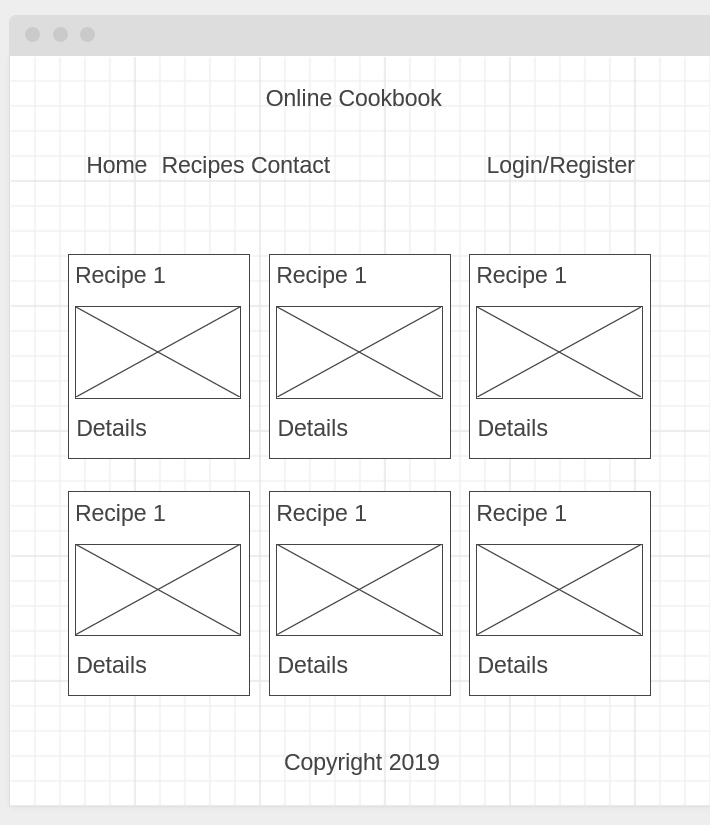
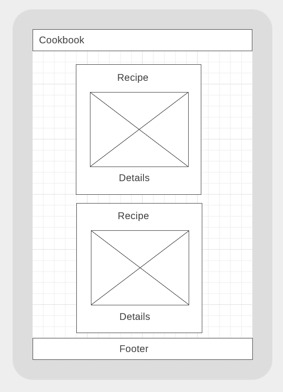
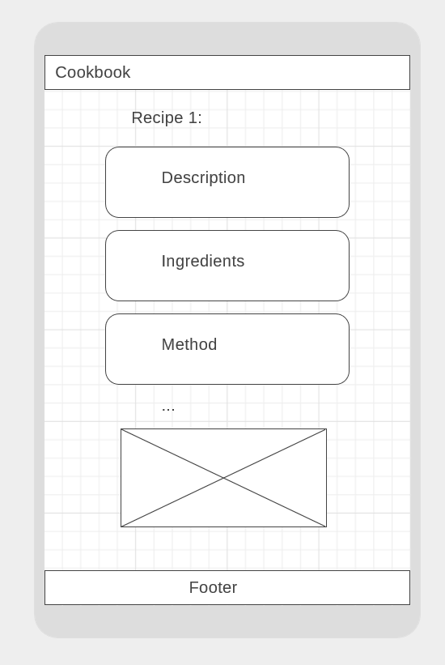

# Milestone Project 3
## Online Cookbook

Design and implement a web application where users can share cooking recipes and view a list of recipes available.

Demo application deployed [here](https://cookbook2019.herokuapp.com/)  

Demo login:  
email: test@email.com  
Password: testpass1

## UX

### User stories:

- View all recipes available.
- View all recipe shared by a particular user
- Search for text in title, description, ingredients, method, allergy etc...
- View information about a recipe.
- Be able to create and share a recipe, with a picture URL
- Edit or delete an exiting recipe after creation

### Wireframes: 

 

## Features

### Existing Features

- User authentication
- User account with list of recipes created
- List view of all recipes in cards
- Search for a word or expression in the fields: title, description, ingredients, method, allergy.
- Detail view with all information
- List view of recipes created by a particular user
- Option to create a new recipe
- Option to edit a recipe already created
- Option de delete, with confirmation
- Pagination
- About page

### Features left to implement

- Contact form
- Password reset
- Optimise the full text search
- Add more models to the database to refine the usability
- Markdown support in the text fields
- Admin
- Automated tests including functional tests using Selenium

## Technologies used

- HTML5, CSS3, Bootstrap
- Javascript
- Python language
- Flask framework
- Sqlalchemy
- PostgreSQL database system
- WTF forms
- Bcrypt to encrypt passwords
- LoginManager to manage authentication
- Heroku to deploy a Demo app
- Heroku PostgreSQL addon to host the database

## Testing

- HTML and CSS of all pages was tested to be valid with W3 tool
- Functional tests weere carried out manualy to test all routes and functionalities expected in the user stories.
- 