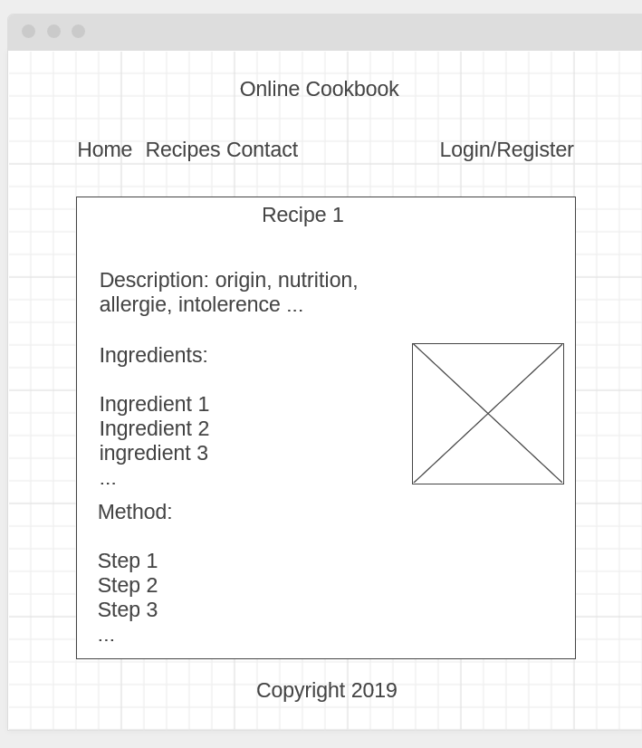

# Milestone Project 3
## Online Cookbook

Design and implement a web application where users can share cooking recipes and view a list of recipes available.

Demo application deployed [here](https://cookbook2019.herokuapp.com/)  

Demo login:  
email: test@email.com  
Password: testpass1

## UX

### User stories:

- View all recipes available.
- View all recipe shared by a particular user
- Search for text in title, description, ingredients, method, allergy etc...
- View information about a recipe.
- Be able to create and share a recipe, with a picture URL
- Edit or delete an exiting recipe after creation

### Wireframes: 

 

 

## Features

### Existing Features

- User authentication
- User account with list of recipes created
- List view of all recipes in cards
- Search for a word or expression in the fields: title, description, ingredients, method, allergy.
- Detail view with all information
- List view of recipes created by a particular user
- Option to create a new recipe
- Option to edit a recipe already created
- Option de delete, with confirmation
- Pagination
- About page

### Features left to implement

- Contact form
- Password reset
- Optimise the full text search
- Add more models to the database to refine the usability
- Markdown support in the text fields
- Admin
- Automated tests including functional tests using Selenium

## Technologies used

- HTML5, CSS3, Bootstrap
- Javascript
- Python language
- Flask framework
- Sqlalchemy
- PostgreSQL database system
- WTF forms
- Bcrypt to encrypt passwords
- LoginManager to manage authentication
- Heroku to deploy a Demo app
- Heroku PostgreSQL addon to host the database

## Testing

- HTML and CSS of all pages was tested to be valid with W3 tool
- The application was tested for responsiveness and functionality on different screen sizes and mobile
- Functional user tests were carried out manualy to test all routes and functionalities expected in the user stories
- Try empty space and different expressions in the search box, one or many words with spaces, with all the fields
- In the recipe detail view, try to edit and delete without being authenticated
- In the user registration, all fields were tested with different input.
- While authenticated tried to update and delete other users recipes.
- In the new recipe page tried different invalid inputs.
- Login with invalid credentials
- While authenticated, remove recipes then check in the results.
- While authenticated, update all fields of a recipe and check if they were saved.
- Search for expressions known to exist and see if they are displayed in the results, for every field.

## Deployment

- Clone the repository
- Start a virtual environement with pipenv
- Install dependencies with 'pipenv install'
- Initiate a git local repository
- For local testing and development, create .env file and include values for these variables: SECRET_KEY, DATABASE_URL.
- Restart pipenv
- Create an app in Heroku
- Add a PostgreSQL addon in heroku
- In Heroku settings add environement variables for: SECRET_KEY, IP (0.0.0.0), PORT (5000)
- Deploy to heroku following the instructions [here](https://devcenter.heroku.com/articles/git)

## Credits

- Code Intitute Material
- The Flask Mega Tutorial by Miguel Grinberg

### Content

- [BBc food recipes](bbc.co.uk/food/recipes)

### Design

Rafocus